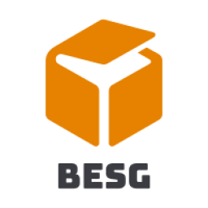

<p align="center">
   
   <h3 align="center">BESG Official 🔥</h3>
</p>
<p align="center">
  
</p>


## Overview

Official website of BESG - an online web development sharing group, sharing web technologies including frontend, backend, cloud and DevOps every week.

Sharing Time: 9:30 PM ervey week @Discord
Site URL : https://besg-web.vercel.app/

## Dependency

- Next.js
- styled-components
- framer-motion
- ioredis
- Next.js serverless function

## How to run it on local

clone the repo, and run

```bash
npm install
# or
yarn install
```

After install the dependencies

```bash
npm run dev
# or
yarn run dev
```

## How to join us ?

Click the [discord link](https://discord.gg/8uB4pmGtBj).

## License

Distributed under the MIT License. See `license` for more information.
